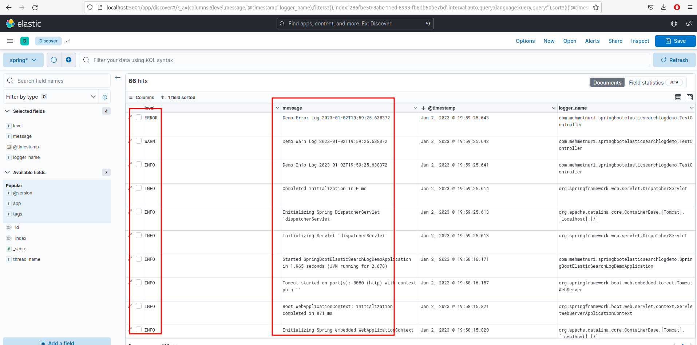

# Spring Boot Elastic Search Kibana Logstash Example

This is a simple example of how to use Spring Boot, Elastic Search, Kibana and Logstash.

## Requirements
 - Java 11
 - Docker
 - Docker Compose
 - Maven

## How to run
- Clone the repository
- Run `mvn clean install`
- Go to docker folder
- Run `docker-compose up -d`
- Go to http://localhost:5601
- Go to Management -> Index Patterns -> Create Index Pattern
- Set the index pattern to `sp-*` and click Next Step
- Set the Time Filter field name to `@timestamp` and click Create Index Pattern
- Go to Discover and you should see the logs
- Go to http://localhost:8080/

## How to stop
- Go to docker folder
- Run `docker-compose down`

# Test UI

